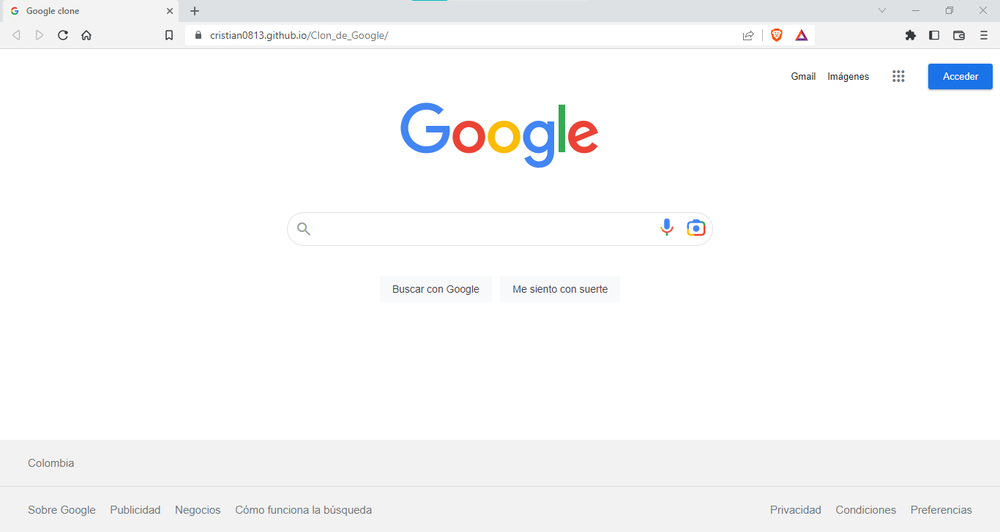

<h1 align="center">Clon de Google</h1>

<a href="https://cristian0813.github.io/Clon_de_Google/">

<h3> HTML, se usa los siguientes elemento como: </h3>

 Conectores de links

Etiquete DIV

Etiqueta NAV

Etiqueta UL e LI

Etiqueta SPAN

Etiqueta footer

Etiqueta Header

<h3> CSS, se usa los siguientes elemento como:</h3>

Elemento HOVER

Elemento FOCUS

<h2>Lenguajes de programacion usados</h2>

HTML

CSS
